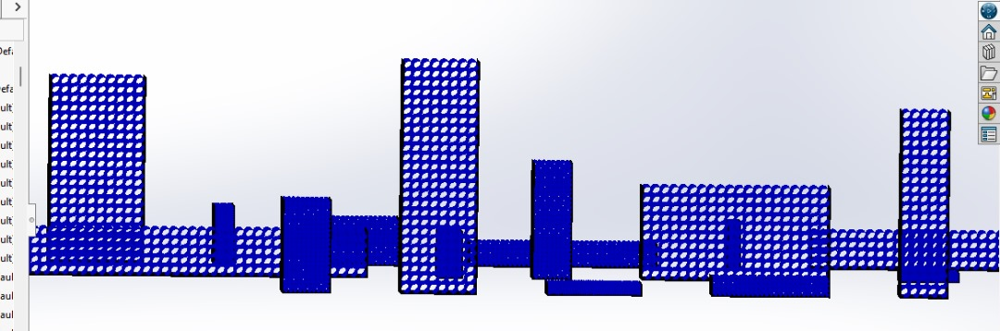
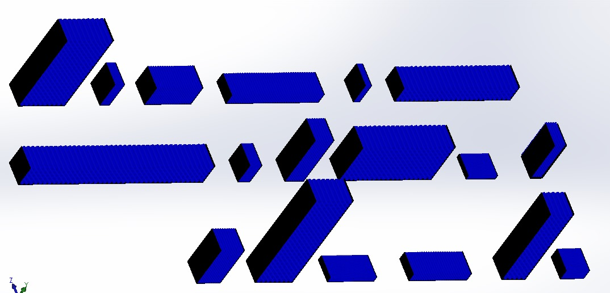
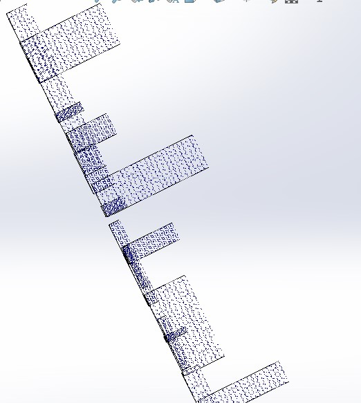
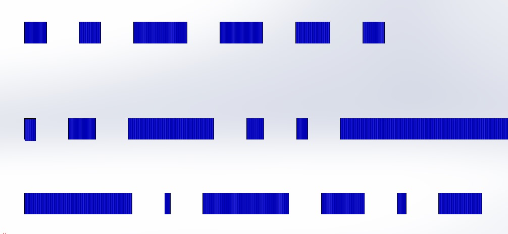
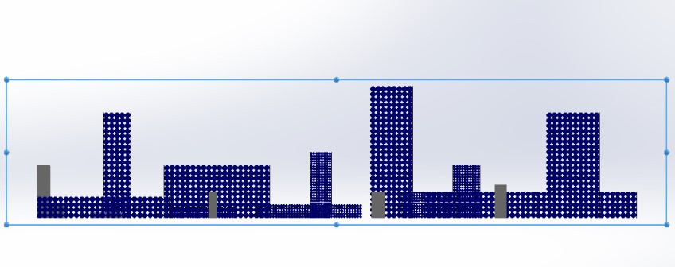

# 🏭 Pipe Warehouse Digital Twin  
**Aurora Robotics – Internal R&D Project**

---

## 📌 Project Vision

This project is part of an **internal Aurora Robotics research initiative** focused on building a **simulation-first digital twin of an industrial pipe warehouse** for autonomous inspection.

The long-term objective is to enable **robotics and computer vision systems**—specifically **aerial drones**—to autonomously navigate a pipe warehouse, **detect, classify, and count pipes** stored in dense industrial racks.

To achieve this in a robust and scalable way, the project follows a layered approach:

1. **High-fidelity factory modeling (this repository)**  
2. Physics-based simulation  
3. Robot navigation and autonomy  
4. Vision-based pipe detection and inventory estimation  

This repository represents **Phase 1: Environment & Factory Modeling**.





---

## 🧱 Scope of This Repository (Read This First)

⚠️ **This repository contains ONLY the CAD model of the factory environment.**

It does **not** include:
- Robot or drone models  
- Sensors or cameras  
- Simulation physics  
- Computer vision pipelines  
- Control or autonomy logic  

Its purpose is to act as a **ground-truth digital representation of the pipe warehouse**, which future Aurora robotics projects will build upon.

> In short: **this repo defines the world before the robot exists.**

---

## 🏗️ What Is Modeled in This Digital Twin?

This repository contains a **high-fidelity SolidWorks digital twin** of an industrial pipe warehouse, including:

### ✔ Pipe Inventory
- Multiple **pipe lengths**
- Different **cross-sections and dimensions**
- High-density storage configurations

### ✔ Rack Systems
- Modular rack designs
- Different rack heights and orientations
- Realistic industrial storage geometry

### ✔ Warehouse Layout
- Structured aisles suitable for robotic navigation
- Consistent global reference frames
- Scalable layout for simulation and autonomy research

The environment is intentionally designed to reflect **real inspection challenges**, including:
- Occlusion
- Dense packing
- Mixed pipe sizes
- Complex spatial arrangements

---
## 📌 Repo Overview

This repository contains high-fidelity **3D CAD models and assemblies** representing an industrial pipe warehouse environment. Designed in **SolidWorks**, the project serves as a simulation-ready digital twin for autonomous robotics testing, path planning validation, and warehouse logistics optimization.

The assembly features a modular rack system, high-density pipe inventory (>3,000 components), and a scalable layout optimized for large-assembly performance on standard hardware.

## 🛠️ Tools & Technologies

- **Software:** SolidWorks 2024 (Assembly, Part Modeling, Large Assembly Mode)  
- **Key Techniques:** Linear Component Patterns, Lightweight Mode, Advanced Mates, Pack & Go  
- **Version Control:** Git & GitHub (optimized with `.gitignore` for CAD artifacts)

## 📂 Project Structure
This project was consolidated using SolidWorks **Pack and Go** to ensure zero broken references. All CAD assets are located in the `/CAD` directory as a flat list.

The file naming convention follows the logic: `[Rows]x[Columns]__[PipeLength]`.

```text
/pipe-warehouse-digital-twin        (Repository Root)
│
├── /CAD                            (Flattened Pack & Go Directory)
│   ├── Gen_assembly.SLDASM         (The Master Warehouse Assembly)
│   │
│   ├── [Inventory Components]
│   ├── Pipe_500mm.SLDPRT
│   ├── Pipe_1000mm.SLDPRT
│   ├── Pipe_2000mm.SLDPRT
│   │
│   ├── [Rack Assemblies & Parts]   (Parametric variations)
│   ├── 10x20__0.5assembly.SLDASM
│   ├── 10x20__0.5mRack.SLDPRT
│   ├── 20x10__1massembly.SLDASM
│   ├── 20x10__1mRack.SLDPRT
│   ├── ... (and other dimensional variants)
│
├── README.md                       (Project Documentation)
└── .gitignore                      (Filters SW lock files & temp data)
```

## 👁️ Model Views & Visual References

Below are selected views from the current CAD model showing the warehouse layout, rack organization, and pipe varieties.

> 📁 **All images are stored in the `/images` directory.**

### 🟦 Isometric View – Full Rack & Pipe Assembly
Shows the overall spatial arrangement of racks and pipe inventory.


---

### 🟦 Front View – Pipe Stacking & Rack Geometry
Highlights pipe stacking logic, rack heights, and spacing.


---

### 🟦 Angled View – Depth & Occlusion Representation
Demonstrates depth complexity and occlusion challenges relevant to vision systems.



---

### 🟦 Top View – Warehouse Layout & Aisle Planning
Useful for future navigation, path planning, and mapping.



---

### 🟦 Individual Pipe Variants
Different pipe lengths and geometries used across the warehouse.



---

## 🛠️ Tools & Design Approach

- **CAD Software:** SolidWorks 2024  
- **Assembly Strategy:** Large-assembly-safe design  
- **Performance Techniques:**
  - Linear Component Patterns
  - Geometry Patterns
  - Lightweight component loading
  - Pack & Go consolidation (zero broken references)

The model is optimized to remain **simulation-ready** without overwhelming standard engineering hardware.

---

## 🚀 How This Fits into Aurora’s Roadmap

This digital twin will later be used to:
- Import into robotics simulators (Gazebo / Isaac / custom)
- Design drone navigation paths
- Develop perception and counting algorithms
- Benchmark vision robustness under occlusion
- Enable simulation-to-reality transfer

Future phases will **extend this environment**, not replace it.

---


## 🧭 Project Status

- **Current Phase:** CAD & Environment Modeling  
- **Next Phase:** Simulation Integration  
- **Project Type:** Aurora Internal R&D  
- **Lead Contributor:** Abdullahi (Aurora Intern)

---

## 🧠 Summary

> *We are building the world first — then teaching robots how to understand it.*
